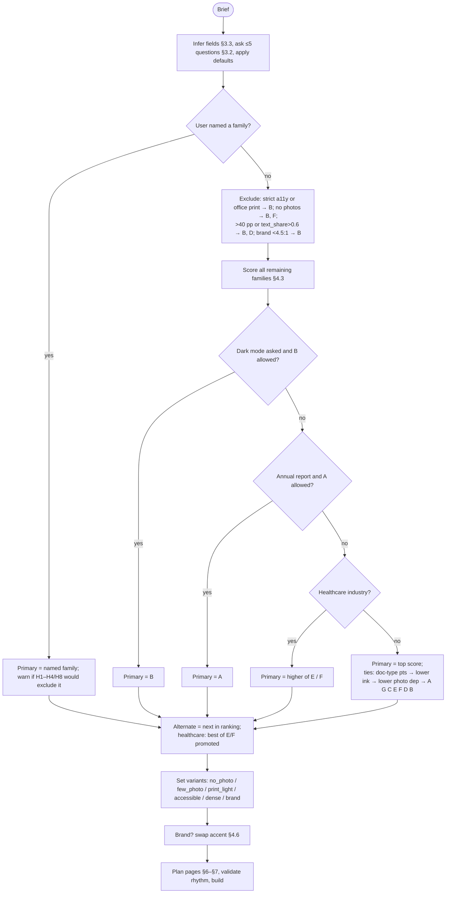

# Selection framework: which design to use for a given document

Owner: selection research agent. Scope: decision logic only (which family, which layouts, in which order).
Per-board build specs (exact sizes, tokens, components) are written by other agents; layout IDs used here are a
proposed shared vocabulary and should be reconciled with theirs [inferred].

Evidence tags: **[seen]** = visible on the boards (`ref-A … ref-G.jpeg`, viewed whole and in upscaled crops);
**[inferred]** = my design judgement or a derived rule; **[uncertain]** = plausible but not verified.
Web research was done with WebSearch (sources at the end); the rest is professional practice, tagged [inferred].
All contrast ratios below were computed with the WCAG 2.x relative-luminance formula from the measured hex values
in CONTEXT.md [seen → computed].

The scoring tables, hard rules, tie-breaks and rhythm checks in this file are also given as a runnable Python
reference implementation in Appendix A. Every worked example in §8 is the actual output of that code, so two runs
on the same brief give the same answer.

---

## 0. The seven families in one line each

| Code | Board | One-line identity |
|---|---|---|
| **A** | Rapport annuel 2025 (navy) | Institutional annual report: navy covers and 1/3 navy side panels, KPI rows, single-hue bar chart, org chart, world map, numbered "perspectives" tiles [seen] |
| **B** | Breakslide (dark green) | Dark mode: deep green pages, tall vertical colour bars over photos, three-dot motif, icon circles [seen] |
| **C** | Business Plan Presentation (green/black) | White pages, black-and-white photos in cut-corner/diagonal masks, green used sparingly for big numerals and small blocks, black blocks as second "colour" [seen] |
| **D** | Prism (teal, rounded) | Rounded slabs and pills holding text, half-round photo crops, "break slide" panels, playful [seen] |
| **E** | Clinicare (aqua medical) | Airy white pages, pale aqua tint panels, circular photo crops, clinical photography [seen] |
| **F** | Docoro (royal blue healthcare) | Saturated blue blocks that cut through photos, blue photo overlays, big stat figures, staff grids, pricing/testimonial rows [seen] |
| **G** | Market (teal, inset frame) | Thin inset outline frame, vertical tab with rotated text, tag hanging off the top edge, half-page photos, teal blocks [seen] |

---

## 1. Document types: what readers expect

Columns: density (words per A4 page that readers tolerate), tone, colour and photo appropriateness, typical sections.
Where a source is listed it informed the row; the specific numbers are [inferred] unless noted.

| Document type | Reader and reading mode | Density | Tone | Colour | Photography | Typical sections | Default family (Appendix A) |
|---|---|---|---|---|---|---|---|
| **Annual report** | Shareholders, board, analysts, staff; skims highlights, then reads selectively. Readers have mixed financial literacy, so visuals carry the numbers (Infogram, infodiagram) | Mixed: airy front half (letter, highlights), dense back half (statements) | Confident, institutional | Brand colour in large fields is expected on covers and openers | People (leadership), operations, places; moderate | Cover, contents, chair/CEO letter, highlights of the year, strategy/mission, operating review, financial review, governance, risk, sustainability, outlook, financial statements, back cover (Infogram; rebrand.com.my) | **A** / G |
| **Consultancy deliverable** | Client executives; reads the executive summary and the action titles, then the evidence. Conclusion first (Minto pyramid; SCQA) | Medium–high; every page states its "so what" | Neutral, assertive, evidence-led | Restrained; colour marks the answer, not decoration | Rare; diagrams and charts instead | Exec summary (answer), context and scope, approach, findings by workstream, options, recommendations, roadmap, appendix (deckary.com; consultantsmind) | **G** / A |
| **Business plan / pitch document** | Investors, lenders; fast skim, numbers-first | Low–medium | Ambitious, modern | Moderate; one bright accent on numbers | Team headshots, product shots | Summary and ask, problem, solution, market size, competition, business model, go-to-market, milestones, team, financials, the ask (C board shows most of these [seen]) | **C** / G |
| **Investor update (monthly/quarterly)** | Existing investors; 2-minute read, same structure each time | Low; 3–5 KPIs, short bullets | Candid, factual | Minimal | None | TL;DR, KPIs vs last period and plan, highlights, lowlights, asks, thanks (btov.vc; codingvc; waveup) | **G** / A (C within 1 point) |
| **Healthcare clinical / quality report** | Board, regulator, clinical leads; reads tables carefully, often printed for meetings | Medium–high; many tables | Sober, precise, reassuring | Calm, cool hues; colour must not imply RAG status unless it is RAG | Few; staff and care settings | Summary, safety, effectiveness, patient experience, workforce, improvement priorities, action plan, definitions | **E** / A (H6 rule) |
| **Patient / public health information** | Patients and carers, all literacy levels | Low; short chunks, 12 pt+ body, 1.5 spacing, 15–20-word sentences (NHS / ACSQHC / HIQA guidance) | Plain, warm, never patronising | Light; high contrast text essential | Reassuring, real people | What it is, what to expect, steps, risks, after care, contacts | **E** / F |
| **Healthcare services brochure** | Prospective patients, referrers | Low | Warm, confident | Strong brand colour acceptable | Essential, plenty | Welcome, about us, services, how a visit works, our doctors, testimonials, contact | **F** / E |
| **ESG / sustainability report** | Investors, rating agencies, regulators, public; navigates by topic and by framework index | Medium–high; data tables and a GRI/ESRS content index are mandatory for framework reporting (Crowe; FMO) | Accountable, factual, forward-looking | Brand or nature hues; avoid "greenwash" saturation | Projects, people, places; moderate | CEO letter, highlights, about this report, materiality, environment, social, governance, targets and progress, data tables, content index, assurance | **A** / G |
| **Research / white paper** | Professionals reading at length, mostly on screen as PDF (thatwhitepaperguy) | High; problem → evidence → solution over 6–20 pp; 50–75-char measure, ~1.4–1.5 leading | Authoritative, neutral | Low; colour for charts and callouts | Rare | Abstract/summary, problem, background, evidence, analysis, implications, recommendations, references | **G** / A |
| **Internal operations review** | Management team; printed for a meeting, annotated | Medium–high | Direct, unvarnished | Low (office printing) | None | Summary, KPIs vs target, performance by area, issues and risks, actions with owners, appendix | **G** / C |
| **Grant / public-sector report** | Funders, officials, public; legal accessibility duties (Equality Act / PSBAR in the UK), real heading styles, contrast-checked colour (GOV.UK) | Medium–high | Formal, plain English | Low–moderate, contrast-checked | Some; community and programme photos | Summary, background, objectives, activities, outcomes vs targets, finance, lessons, next steps, annexes | **A** / G |
| **Proposal / tender** | Evaluators scoring against criteria; looks for compliance and evidence | Medium | Persuasive but precise | Moderate brand colour | Some (team, past work) | Cover letter, summary, understanding of need, approach, plan and timeline, team, case studies, pricing, terms | **G** / A |
| **Product / marketing brochure** | Prospects; browses, does not read | Low | Energetic, aspirational | High | Essential, plenty | Hero, benefits, features, proof, pricing/options, call to action | **D** / G |
| **Company profile / capability statement** | Clients, partners | Low–medium | Professional, polished | Moderate | Plenty | About, services, sectors, clients, team, case studies, contact | **G** / A |
| **Portfolio / agency profile** | Creative buyers | Very low | Expressive | High; dark mode acceptable on screen | Dominant | Intro, work, services, team, contact | **D** / B |

The "Default family" column is what Appendix A returns for that type with typical defaults (listed in §3.4); real
briefs change it through the other criteria.

---

## 2. Design-family profiles

Scales: 1 = low, 5 = high. "Density tolerance" is 1–3 (1 ≈ <250 words/page comfortable, 2 ≈ 250–450,
3 ≈ >450 or table-heavy). "Ink" = share of the page covered by solid colour, used as print cost.
"Residual a11y risk" = the risk that remains **after** the skill's mandatory fixes (deep shades for text, contrast
checks), 1–5. "DOCX robustness" 1–3 = how reliably the look survives python-docx + LibreOffice and later editing by
a client in Word [inferred].

| | A Navy annual | B Dark green | C Green/black plan | D Prism rounded | E Clinicare aqua | F Docoro blue | G Market frame |
|---|---|---|---|---|---|---|---|
| **Mood** | Institutional, calm, trustworthy | Premium, moody, nature/lifestyle | Modern, pragmatic, start-up | Friendly, playful, approachable | Clean, clinical, caring | Bold, energetic, service-led | Composed, corporate-editorial |
| **Formality** | 5 | 2 | 3 | 2 | 3 | 3 | 4 |
| **Density tolerance** | 3 (finance charts, org chart, map, KPI pages all on one board) [seen] | 1 (white small text on dark; long reading tiring) [inferred] | 2 (SWOT, market chart, milestones, business-model grid) [seen] | 1 (text lives inside slabs and pills, so text area is small) [inferred] | 2 (tint panels can hold lists and tables) [inferred] | 2 (stat rows, chart slide, pricing grid) [seen] | 3 (white pages with frame; multi-column text on "Marketing / Purpose" page) [seen] |
| **Colour intensity** | 5 (navy ≈29 % of pixels; full covers, 1/3 panels) | 5 (dark page plus 31 % + 10 % greens) | 2 (green 2.7 %, but black blocks) | 4 (teal 15 %, big slabs) | 2 (aqua 6 % + pale tint) | 4 (blue 11 %, saturated, overlays) | 2 (teal 6 %) |
| **Photo dependency** | 2 (KPI, finance, org, map, perspectives pages are photo-free [seen]) | 5 (almost every slide has photo + colour bar [seen]) | 3 (most pages photo-led, but objective, SWOT, competitor, milestone, conclusion pages are photo-free [seen]) | 4 | 4 (photo on nearly every slide [seen]) | 5 (photo grids, overlays, photo-cutting blocks [seen]) | 3 (half-page photos; frame, tab and option pages work without [seen]) |
| **Print cost (ink)** | 4 | 5 | 2 | 3 | 2 | 4 | 2 |
| **Residual a11y risk** | 1: navy #1A2E5F is 13.1:1 with white. Watch small caption text on navy and the light-blue year on navy (≈4.9:1 for a guessed #3FA9D9 [uncertain]) | 4: dark mode for long reading; grey ink-soft #5B6270 on #005B58 is only 1.3:1, so all captions must be white/tint; second green #177664 is 5.5:1 with white (OK) | 2: green #5AB14D is **2.68:1** with white, failing even the 3:1 large-text threshold; big numerals need deep green #43853A (4.5:1) under strict a11y. Black text on green fill is 5.9:1 (OK) | 3: white on #349B86 is 3.40:1 (large bold text only); deep #2C8472 for 4.5:1; small text in pills | 3: aqua #4DCCD4 is **1.93:1** with white, so white text on aqua (as on the board's "Break Slide" [seen]) fails; ink on aqua is 8.2:1 (use dark text on aqua fills). Aqua rules on tint #E9F8F8 are 1.77:1, failing 3:1 non-text contrast; deep #218288 (4.5:1) / #186165 (7:1) needed | 2: #05369F is 10.3:1 with white; risk is white text on photo overlays | 2: #01A198 is 3.20:1 with white (large bold only); deep #01857E (4.5:1); rotated tab text must be decorative or duplicated in body |
| **DOCX robustness** | 3: rectangles, table-cell shading, panels | 1: per-page dark backgrounds need full-page anchored shapes; hard for clients to edit | 2: cut-corner masks must be pre-rendered images (PIL) | 1: rounded slabs = DrawingML roundRect or images; LibreOffice/Word fidelity [uncertain] | 2: circles via PIL-cropped images, tints via cell shading | 2: overlays pre-composited in PIL | 3: page border for the frame (sectPr pgBorders), rotated text cell for the tab |
| **No-photo variant** | Native: dotted pattern / diagonal line motif on navy, map, charts [seen] | Weak: colour bars on dark without photos lose the identity [inferred] | Good: black and green diagonal blocks instead of masked photos [inferred] | Medium: plain slabs and pills [inferred] | Medium: tint panels + circle icon chips instead of circle photos [inferred] | Weak: blocks have nothing to "cut through" [inferred] | Good: frame + tab + teal block in the photo slot [inferred] |

Text-safe deep shades computed by darkening each measured accent in HSL until it reaches the target contrast with
white (proposals, not seen on the boards) [inferred]:

| Accent | vs white | Deep ≥4.5:1 | Deep ≥7:1 |
|---|---|---|---|
| A #1A2E5F | 13.13 | itself | itself |
| B #005B58 | 7.96 | itself | itself |
| C #5AB14D | 2.68 | #43853A | #32632B |
| D #349B86 | 3.40 | #2C8472 | #216254 |
| E #4DCCD4 | 1.93 | #218288 | #186165 |
| F #05369F | 10.32 | itself | itself |
| G #01A198 | 3.20 | #01857E | #01645F |

---

## 3. Intake: questions and defaults

### 3.1 Principle
Infer first from the supplied content and request; ask **one round** of at most **five** questions, only for
fields that cannot be inferred and that change the outcome. State every default you applied in the delivery note.
Each answer maps to one field of the brief used by the scorer (Appendix A).

### 3.2 Questions (in priority order)

| # | Question (as asked) | Brief field | Ask when | Default if unanswered |
|---|---|---|---|---|
| Q1 | "What kind of document is this, and who will read it?" | `doctype`, `audience` | Type not obvious from title/content | Infer from keywords (§3.3); audience default per type (§3.4) |
| Q2 | "Do you have photos we can use? Roughly how many, and are they good quality?" | `photos` = none / few (1 per 4+ pages) / plenty (≥1 per 3 pages) | Always, unless images were supplied or the type is text-only (white paper, ops review) | `none` (never assume stock; no stock imagery is generated) |
| Q3 | "Any brand colour (hex) or fonts we must use?" | `brand_hex`, `brand_fonts` | No brand files supplied | None → family's own accent and type pairing |
| Q4 | "Will it mostly be read on screen, printed in the office, or professionally printed?" | `output` = screen / office_print / pro_print | Always for ≥ 5 pages | `screen` (PDF + DOCX), but avoid >25 % full-colour pages anyway |
| Q5 | "Does anyone need to edit the Word file afterwards, and are there accessibility requirements (public sector, patients, WCAG)?" | `editable`, `a11y` = standard / strict | Public sector, healthcare, education, or client hand-over | `editable = true`; `a11y = strict` for public-sector and patient-facing types, else `standard` |
| (Q6) | Tone: "more conservative or more expressive?" | `tone` | Only if two families tie within 2 points | none (no shift) |
| (Q7) | Dark mode wanted? | `dark` | Only if the user mentions dark/moody/black | false |
| (Q8) | Language | affects caps and text length (FR/DE ≈ +20–30 % length [inferred]) | Not obvious | language of the content |

Never ask: length (infer it), section list (derive it), layout preferences (that is the skill's job).
If the user names a board ("make it like the Docoro one") that is `family` (rule H0) and Q1–Q5 still apply for variants.

### 3.3 Inference rules (deterministic)
- **doctype** from the first matching keyword set in title + headings, in this order: "annual report / rapport annuel / year in review" → annual_report; "sustainability / ESG / CSR / RSE / impact report / GRI" → esg_report; "business plan / pitch / funding" → business_plan; "investor update / quarterly update / shareholder letter" (≤ 8 pp) → investor_update; "quality / patient safety / clinical audit / outcomes" → clinical_report; "patient information / leaflet / your procedure" → patient_info; "clinic / our services / our doctors" → health_brochure; "white paper / research / study / insight" → white_paper; "operations review / monthly review / performance review" → ops_review; "grant / evaluation / programme report / public consultation" → grant_public; "proposal / tender / RFP / bid" → proposal; "brochure / product / catalogue" → marketing; "company profile / capabilities / about us" → company_profile; "portfolio / showcase" → portfolio; client-facing analysis with recommendations → consulting. No match → consulting.
- **industry**: finance (bank, insurer, fund, accounting), healthcare (hospital, clinic, pharma, medtech, care), tech, environment (energy, agri, water, climate, ESG-led), industrial (logistics, manufacturing, construction, real estate), public (government, NGO, education, charity), creative (agency, hospitality, fashion, lifestyle), professional (consulting, legal), else general.
- **pages** (target): if the user gives a length, use it; else `round(words / 300 + charts × 0.5 + tables × 0.5 + front/back matter)`, where front/back matter = 0 (≤ 4 pp), 3 (5–20), 5 (21+).
- **words_per_page** = body words ÷ content pages (pages minus cover/contents/openers/back).
- **tables** = number of tables with ≥ 4 rows. **text_share** = prose words ÷ all words (table cells included).

### 3.4 Defaults by document type (used when Q1 is answered but nothing else)
annual_report: shareholders, general, 24 pp, few photos, screen · esg_report: investors + public, environment ·
consulting: clients, professional, no photos · business_plan: investors, tech · investor_update: investors, 6 pp,
no photos · clinical_report: board, healthcare, office print · patient_info: patients, strict a11y ·
health_brochure: customers, plenty photos · white_paper: clients, professional, no photos, text_share 0.7 ·
ops_review: management, office print, no photos · grant_public: regulator + public, office print, strict a11y ·
proposal: clients, professional · marketing / company_profile / portfolio: plenty photos, screen. [inferred]

---

## 4. Scoring matrix and hard rules

### 4.1 Order of evaluation
1. **H0 explicit choice**: user names a family → it is primary (warn if a hard rule would have excluded it).
2. **Exclusions** H1–H4, H8 remove families from the candidate set.
3. **Score** every candidate (weighted sum below).
4. **Overrides** H9 (dark wanted), H5 (annual report → A), H6 (healthcare → E/F), in that precedence.
5. Else highest score. **Tie-break**: higher doc-type score → lower ink (print cost) → lower photo dependency →
   fixed order **A, G, C, E, F, D, B** (most to least robust in DOCX).
6. **Alternate** = the next family in the ranked candidate list; for healthcare, the best of E/F is promoted to
   alternate if the primary is not E/F.
7. **Variant flags** (§4.5) are set after the family is chosen.
8. **Accent swap** (§4.6) if a brand colour exists.

### 4.2 Hard rules

| ID | Condition | Effect | Reason |
|---|---|---|---|
| H0 | User names a board/family | That family is primary | User intent wins; still apply variants and warnings |
| H1 | `a11y = strict` | Exclude **B**; all families use deep text shades; body ≥ 11 pt (≥ 12 pt patient-facing) | Dark mode and low-contrast greys for long reading |
| H2 | `output = office_print` | Exclude **B**; A, F and D use their tint-panel print variant (§4.5) | Full dark pages band and waste toner on office printers; most office printers cannot print to the edge (≈ 4–5 mm unprintable border) [inferred] |
| H3 | `photos = none` | Exclude **B** and **F** | Their identity is colour cutting through photos; without photos they become generic |
| H4 | `pages > 40` or `text_share > 0.6` | Exclude **B** and **D** | Low density tolerance; long reading in slabs or dark mode |
| H5 | `doctype = annual_report` and A not excluded | **A** primary | The only real report on the board is an annual report [seen] |
| H6 | `industry = healthcare` (and H5 not triggered) | Primary = best-scoring of **E/F**; if H5 put A first, best of E/F becomes alternate | Brief requirement; the two healthcare boards encode sector cues (clinical photography, cool hues) |
| H8 | Brand colour has < 4.5:1 contrast with white | Exclude **B** | B shows its accent as page background; a light brand colour would only survive as an invented dark shade |
| H9 | `dark = true` and B not excluded | **B** primary | Dark mode is never the automatic choice for a printable report; it must be asked for |

Note on H6: in worked example 2 the scorer ranks A above E on points (65 vs 54): a board-level quality report is
dense and formal. H6 still makes E primary, as required, and A becomes the alternate. The skill should say so in
one line ("E is the healthcare default; A fits the density better if you prefer").

### 4.3 Criteria and weights

Each criterion gives a family 0–3 points; total = Σ weight × points. Maximum = 72 by default (78–81 when the
editable/strict weights rise).

| Criterion | Weight | How points are given (0–3) |
|---|---|---|
| Doc-type fit | **5** | Lookup table 4.4a |
| Audience formality | 3 | Required formality = max over audiences (regulator/board/shareholders 5, investors/clients 4, management/staff/public/patients 3, customers/creative 2), ±1 for `tone` conservative/expressive. Points = max(0, 3 − \|family formality − required\|) |
| Density fit | 3 | Need = 1 if words/page < 250, 2 if ≤ 450, else 3; need = 3 if ≥ 4 tables. Points = 3 if tolerance ≥ need, 1 if one short, else 0 |
| Photo availability | 3 | plenty → 3 for all; few → 3 − max(0, dependency − 3); none → 3 − max(0, dependency − 2); floor 0 |
| Industry fit | 2 | Lookup table 4.4b |
| Output / print cost | 2 | screen → 3; pro_print → 3 − max(0, ink − 3); office_print → 3 − max(0, ink − 2) |
| Accessibility | 2 (3 if strict) | 3 − max(0, residual risk − k), k = 1 strict, 2 standard |
| DOCX robustness | 1 (3 if editable) | robustness value (1–3) |
| Length | 2 | ≤ 4 pp → 3; 5–20 pp → min(3, density tolerance + 1); > 20 pp → density tolerance |
| Brand hue proximity | 1 | Hue distance brand ↔ family accent: ≤ 30° → 3, ≤ 60° → 2, ≤ 90° → 1, else 0. Neutral brand (saturation < 0.15): C 3, others 1. No brand: 0 for all |

Brand colour is deliberately the lightest criterion: families are chosen by **structure**, then the accent is
swapped (§4.6). That is how "brand colour given → nearest family by structure, swap accent" is made deterministic.

### 4.4 Lookup tables

**4.4a Doc-type fit (0–3)**

| doctype | A | B | C | D | E | F | G |
|---|---|---|---|---|---|---|---|
| annual_report | 3 | 1 | 1 | 1 | 1 | 1 | 2 |
| esg_report | 3 | 2 | 1 | 1 | 1 | 0 | 2 |
| consulting | 2 | 0 | 2 | 1 | 0 | 1 | 3 |
| business_plan | 1 | 1 | 3 | 2 | 0 | 1 | 2 |
| investor_update | 2 | 0 | 3 | 1 | 0 | 1 | 2 |
| clinical_report | 2 | 0 | 0 | 0 | 3 | 2 | 1 |
| patient_info | 1 | 0 | 0 | 1 | 3 | 2 | 1 |
| health_brochure | 0 | 0 | 0 | 1 | 2 | 3 | 1 |
| white_paper | 2 | 0 | 1 | 1 | 1 | 0 | 3 |
| ops_review | 2 | 0 | 3 | 1 | 1 | 1 | 2 |
| grant_public | 3 | 0 | 1 | 0 | 1 | 1 | 2 |
| proposal | 2 | 1 | 2 | 1 | 0 | 1 | 3 |
| marketing | 0 | 3 | 2 | 3 | 1 | 2 | 2 |
| company_profile | 2 | 2 | 2 | 2 | 1 | 2 | 3 |
| portfolio | 0 | 3 | 1 | 3 | 0 | 2 | 1 |

**4.4b Industry fit (0–3)**

| industry | A | B | C | D | E | F | G |
|---|---|---|---|---|---|---|---|
| finance | 3 | 0 | 1 | 0 | 0 | 2 | 2 |
| healthcare | 1 | 0 | 0 | 1 | 3 | 3 | 1 |
| tech | 1 | 1 | 3 | 3 | 1 | 2 | 2 |
| environment | 2 | 3 | 2 | 2 | 1 | 0 | 2 |
| industrial | 2 | 1 | 2 | 1 | 0 | 1 | 3 |
| public | 3 | 0 | 1 | 2 | 2 | 1 | 2 |
| creative | 0 | 3 | 1 | 3 | 1 | 2 | 1 |
| professional | 2 | 0 | 2 | 1 | 0 | 1 | 3 |
| general | 2 | 1 | 2 | 2 | 1 | 1 | 2 |

**4.4c Family attributes used by the formulas** (from §2): formality A5 B2 C3 D2 E3 F3 G4; density tolerance
A3 B1 C2 D1 E2 F2 G3; photo dependency A2 B5 C3 D4 E4 F5 G3; ink A4 B5 C2 D3 E2 F4 G2; residual a11y risk A1 B4 C2
D3 E3 F2 G2; robustness A3 B1 C2 D1 E2 F2 G3; accent hue A 223° B 178° C 112° D 168° E 184° F 221° G 177°.

### 4.5 Variant flags (set after choosing the family)

| Flag | Trigger | What changes [inferred] |
|---|---|---|
| `no_photo` | photos = none | Photo slots become accent blocks, pattern/motif panels (A dots/lines, C diagonal blocks, G teal block in frame), charts or KPI tiles; team pages use initials monograms; never stock photos |
| `few_photo` | photos = few | Photos only on cover, foreword and ≤ 1 page in 4; rest as no_photo |
| `print_light` | office_print | Full-colour pages ≤ 15 %; openers use tint panel + deep-accent title instead of a solid panel; back cover white; keep 10 mm safe margin for frame/bleeds |
| `accessible` | a11y = strict | Deep ≥ 7:1 shade for all accent text; body 11 pt (12 pt patients); no text on photos; rotated tab text duplicated in body; charts have direct labels and a non-colour cue |
| `dense` | need density 3 and family tolerance < 3 (E, F, C) | Tables on tint panels with full width; 2-column reading pages allowed; KPI pages limited to 1 per section |
| `brand` | brand_hex given | Accent swap (§4.6); brand fonts replace the pairing if they have 400 + 700 weights, else keep body font |

### 4.6 Accent swap (brand colour → family roles)
Each family uses three accent roles: **deep** (text, panels carrying white text), **bright** (fills, large
numerals, chart highlight), **tint** (background panels) [inferred from §2 of DESIGN-user.md].
1. c = contrast(brand, white).
2. If c ≥ 7: deep = brand; bright = brand lightened in HSL until contrast ≈ 3.0–4.5 (fills only); tint = same hue, L 0.95, S ≤ 0.45.
3. If 4.5 ≤ c < 7: deep = brand darkened to 7:1; bright = brand; tint as above.
4. If c < 4.5: bright = brand (fills, ink-coloured text on it must be ≥ 4.5:1); deep = brand darkened to 7:1; tint as above. B is excluded (H8).
5. Keep the family's neutrals (ink #1F2328, ink-soft #5B6270, paper-alt #F2F3F4) and C's black.
6. Charts: shades of the new hue + grey only.
The structure (grid, motif, shapes) of the family never changes with the brand colour.

---

## 5. Decision tree



Quick human version (matches the scorer for typical briefs; the scorer wins when they disagree):
- Annual, ESG, grant / public-sector → **A** (alt G).
- Consulting, white paper, proposal, company profile, investor update, ops review → **G** (alt A; C for ops review).
- Business plan / pitch → **C** (alt G).
- Healthcare: data/board/patient information → **E** (alt A or F); services/marketing with photos → **F** (alt E).
- Marketing brochure, portfolio, expressive tone → **D** (alt G or B); **B** only when dark mode is asked for and output is screen.

---

## 6. Content → layout mapping (family-independent)

### 6.1 Layout vocabulary (proposed IDs)
Density class: **a** = airy, **m** = medium, **d** = dense. Colour pages (counted in §7) are marked ●.

| ID | Layout | Class | Board evidence |
|---|---|---|---|
| COV ● | Cover | a | all boards [seen] |
| TOC | Contents | m | A "Sommaire", C "Content", D "Content list" [seen] |
| FWD | Foreword/letter: portrait + letter + signature or pull quote | m | A "Mot de la direction", F "Founder says" [seen] |
| SUM | Executive summary: KPI strip + 3–5 key points | m | [inferred] |
| OPN ● | Section opener: 1/3 accent panel (number, title, lede) + 2/3 photo/motif | a | A, G "Points", B [seen] |
| BRK ● | Break page: full colour, one sentence | a | D, E "Break slide", F "Break time" [seen] |
| KPI | Highlights: 3–8 big numbers with captions | a | A "Faits marquants", C "Objective" [seen] |
| CHT | Chart page: chart 2/3 + commentary 1/3 (or chart + KPI column) | m | A "Aperçu financier", C "Market analysis" [seen] |
| DNT | Part-to-whole: donut + legend + photo/motif | m | A "Répartition des revenus" [seen] |
| MAP | Geography: map + stat column | m | A "Notre portée mondiale", D "China map" [seen] |
| TXT | Reading page: one column, 60–75 characters, side margin for notes/quotes | d | [inferred]; boards are slides and show no long text |
| TX2 | Two-column reading (> 1.5 pages of continuous text, no figures) | d | G "Marketing / Purpose" columns [seen, short text only] |
| PHS | Photo split: bleed photo on one half + text | m | G "Project name", E, C [seen] |
| TAB | Table page | d | none on boards; DESIGN-user §5.8 [inferred] |
| STP | Steps / process row of 3–5 numbered tiles | a | A "Perspectives 2026", C "Our solutions 01 02 03" [seen] |
| ORG | Org chart | m | A "Structure organisationnelle" [seen] |
| TML | Timeline | m | D "Our timeline", C "Milestones", E "Journey through time" [seen] |
| TEAM | Team grid / row | a | B, C, E, F, G [seen] |
| QTE | Quote / testimonials | a | A quote beside portrait, F "What they say", G quote panel [seen] |
| MTX | 2×2 matrix / SWOT | m | C "SWOT analysis", C "Business model" [seen] |
| CMP | Comparison columns: 2–4 options or pillars | m | G "Lorem option" ×3, C "A./B." operations plan, F pricing [seen] |
| REC | Recommendations: numbered cards with priority / owner / timing | d | [inferred] |
| CAS | Case study: photo + challenge / approach / result + 1–3 numbers | m | F "Our project program" [seen, loosely] |
| APX | Appendix / references / content index | d | [inferred] |
| END ● | Closing / back cover / contact | a | A back cover, C "Thank you", F "Thanks", C/F "Contact" [seen] |

### 6.2 Mapping rules (thresholds are [inferred])

| Content type | Use | Thresholds and rules |
|---|---|---|
| Headline figures | 1–2 → stat callout inside SUM/OPN/TXT; 3–4 → KPI strip (on SUM or KPI page); 5–8 → KPI page in two rows; > 8 → table | Every figure has unit, label ≤ 2 lines and a comparison (vs last year/target) where supplied. Never put boxes around KPIs (DESIGN-user §5.3) |
| Time series | ≤ 12 points, 1 series → column chart, latest bar in deep accent, rest lighter shades; > 12 points or 2–3 series → line chart; ≥ 4 series → small multiples or a table | Direct value labels, no gridlines; CHT page; source line under chart |
| Comparison of categories | 2 items → CMP two-up (A./B.); 3–4 items × ≤ 4 attributes → CMP columns; ≥ 3 items × ≥ 3 attributes or any precise numbers → TAB | Highlight the recommended option with the accent, others neutral |
| Part-to-whole | ≤ 5 parts → donut (DNT) or 100 % bar; > 5 parts → ranked horizontal bars | Donut only if parts sum to 100 % |
| Ranked list | ≤ 10 items with values → sorted horizontal bar (CHT); text-only ≤ 7 → numbered list with big numerals; > 15 → TAB | Sort descending unless order is meaningful |
| Process / steps | 3–5 → STP row; 6–8 → two-column numbered list; > 8 → TAB or split into phases | Step text ≤ 25 words each on STP |
| Org structure | ≤ 3 levels and ≤ 6 children per node → ORG; larger → table of units or indented list | Root in accent box, children as tint pills (A [seen]) |
| Quote | 1 quote ≤ 40 words → pull quote in TXT/FWD margin; 1 quote > 40 words or with portrait → QTE; 2–3 testimonials → QTE row | Never more than one QTE page per 8 pages |
| Long narrative | ≤ 600 words → part of a mixed page; > 600 → TXT; > 1,500 continuous words without figures → TX2 permitted | Insert a pull quote, KPI or figure at least every 2 TXT pages |
| Dense table | ≤ 7 columns portrait TAB; 8–12 columns → landscape TAB; > 12 columns → split; > 30 rows or reference data → APX | Header row repeats; numbers right-aligned; zebra in paper-alt |
| SWOT | MTX, one page, ≤ 5 bullets per quadrant | Big letters S W O T (C [seen]); if any quadrant > 5 bullets, use a 4-row TAB |
| Timeline | ≤ 6 dated events → horizontal TML; 7–12 → vertical TML; > 12 → TAB | Optional value under each date (C milestones [seen]) |
| Team | ≤ 4 people → row; 5–12 → grid; > 12 → table of names/roles | No photos → initials monogram in accent circle; never mix photo and monogram on one page |
| Recommendations | ≤ 6 per REC page; > 6 → REC for top 6 + TAB for the rest | Each: number, action title, 1–3 sentence rationale, meta (priority, owner, timing, effect) |
| Executive summary | SUM within the first 3 content pages of any decision document | Answer first, then 3–5 supporting points, then KPI strip (Minto/SCQA) |
| Methodology / scope | TXT or STP (if it is a sequence) | — |
| Risks / issues | TAB (risk, likelihood, impact, owner) or MTX (likelihood × impact) | MTX only if ≤ 10 risks |
| Map / geography | MAP when ≥ 3 locations and a map image is available; else TAB of locations with KPI strip | — |
| Case study | CAS, one per page, ≤ 250 words | — |
| Pricing / options | CMP (≤ 4 tiers) | Recommended tier in accent |
| Framework index (GRI etc.) | APX, TAB style | — |

---

## 7. Rhythm and length rules

### 7.1 Page budget by length (counts are targets, [inferred])

| Tier | Pages | Cover | Contents | Openers | Break pages | Other |
|---|---|---|---|---|---|---|
| XS | 1–4 | No (title band on page 1) | No | 0 | 0 | SUM first; END optional (contact block on last page) |
| S | 5–8 | Yes | No (brochures) / optional (reports at 8 pp) | 0 | 0–1 | END yes |
| M | 9–20 | Yes | Yes | One per section of ≥ 3 pages (typically 2–4) | ≤ 1 | SUM in first 3 pp; END yes |
| L | 21–40 | Yes | Yes | One per major section (4–7) | ≤ pages ÷ 10, and 0 if there is ≥ 1 opener per 8 pages | APX at end; END |
| XL | > 40 | Yes | Yes | One per section (6–10); part dividers allowed | ≤ 3 | APX; consider splitting annexes into a second file |

### 7.2 Rules (the checker in Appendix A enforces R1–R7)
- **R1 Repetition**: never 3 identical layout IDs in a row, except TXT, TAB, APX which may run to 3 (never 4).
- **R2 Density**: never more than 3 dense (d) pages in a row; back matter (APX run that ends the document) is exempt. After 3 d pages the next page is a or m.
- **R3 Colour budget**: full-colour pages (COV, OPN, BRK, END) ≤ 25 % of pages (≤ 15 % with `print_light`). For B, dark pages are allowed up to 40 % on screen.
- **R4 Spacing**: between two OPN/BRK pages there are at least 2 other pages; a BRK never sits next to an OPN.
- **R5 Breaks**: BRK ≤ pages ÷ 8. Break pages carry one sentence that is supplied or quoted, never invented filler.
- **R6 Contents**: required when the document has ≥ 8 pages, except brochures ≤ 12 pages.
- **R7 Openers**: every OPN is followed by ≥ 2 content pages before the next colour page.
- **R8 Photo pages**: at most 1 full-bleed photo page per 4 pages; consecutive PHS pages alternate photo side.
- **R9 Grid change**: consecutive pages differ in grid or dominant element (panel / reading / strip); two TXT pages in a row are fine, three need a pull quote or figure on the third.
- **R10 Order**: SUM before the first OPN; REC before APX; END last; FWD (if any) directly after TOC.
- **R11 Facing pages (pro print only)**: OPN on right-hand (odd) pages; insert a QTE/KPI or a blank-with-motif page rather than shifting content [inferred].

---

## 8. Mixing rules

**Allowed to combine** (all re-skinned with the chosen family's tokens):
- Structural components common to all families: data table, chart style (one hue + grey, direct labels), KPI strip,
  numbered steps, timeline, org chart, recommendation cards, references list.
- Any layout ID from §6.1, even if its board evidence comes from another family, as long as it is drawn with the
  chosen family's shapes and motif.

**Never combine**:
- **One family per document**; the alternate is an alternative, not a source of extra pages.
- **One signature motif**: A navy panel + dot/line pattern; B dark pages + three dots + vertical colour bars; C cut-corner/diagonal masks + black blocks; D rounded slabs and pills; E pale tint panels + circular crops; F blocks cutting photos + blue duotone; G inset frame + vertical tab + hanging tag. Do not import another family's motif.
- **One corner geometry**: square (A, F), cut/diagonal (C), rounded (D, E, G pills/tags). Never rounded and cut corners in one document.
- **One accent hue** with its deep / bright / tint shades. Black is a second colour only in C. No second accent for "status"; use RAG only where the content is RAG data, in muted shades, with text labels.
- **One type pairing**: one heading face + one body face (can be the same family), at most 4 weights in total, ALL CAPS only for section titles and labels.
- **One photo treatment**: natural colour, or B&W (C), or duotone (F). No mixing B&W and colour except C's B&W + accent block.
- **One icon style**: single-weight line glyphs, in solid circles if the family uses chips. No emoji.
- **Brand overrides only colour and fonts**, never structure.

---

## 9. Worked examples

Each result below is the actual output of Appendix A (score / maximum). Page plans pass the rhythm checker.

### Example 1: Annual report, mid-size insurer
**Brief**: "Rapport annuel 2025" for a French insurer; shareholders and board; ≈ 32 pp; 6 financial tables;
≈ 380 words/page; executive portraits + a few corporate photos (`few`); professionally printed + PDF; brand navy
#00205B; not edited after delivery.
**Result**: **A** 70/72 (H5), alternate **G** 61. C 40, F 37, E 35, D 26, B 17. Variants: few_photo, brand
(#00205B is 15.5:1 so it becomes deep; bright derived).
**Why**: annual report (H5) and finance industry both favour A; navy brand is within 5° of A's hue, so the swap
is nearly invisible; A's photo-free KPI/finance/map pages suit a "few photos" brief. G is the cleaner, cheaper
alternative.
**Page plan (32)**: 1 COV · 2 TOC · 3 FWD (CEO letter + portrait) · 4 KPI (highlights) · 5 OPN Strategy · 6 PHS
(mission & values) · 7 CMP (3 strategic pillars) · 8 TXT (market context) · 9 OPN Financial review · 10 CHT
(5-year premiums) · 11 DNT (revenue split) · 12 TAB (key figures) · 13 CHT (solvency ratio) · 14 TXT (CFO
commentary + pull quote) · 15 MAP (footprint) · 16 CAS (claims-service case) · 17 OPN Governance · 18 ORG · 19
TEAM (board) · 20 TAB (committees, attendance) · 21 TXT (risk management) · 22 MTX (risk map) · 23 OPN CSR · 24
KPI (ESG metrics) · 25 PHS (community) · 26 CHT (emissions trend) · 27 STP (Perspectives 2026, 4 tiles) · 28 OPN
Financial statements · 29 TAB · 30 TAB · 31 APX (notes, glossary) · 32 END.
Colour pages 7/32 = 22 %.

### Example 2: Hospital quality and patient safety report
**Brief**: annual quality account for a hospital trust board and regulator; 20 pp; 7 tables; ≈ 420 words/page;
a few ward photos; printed on office printers for the board pack; strict accessibility (public body); the quality
team edits the DOCX.
**Result**: **E** (H6) 54/81, alternate **A** 65. Ranked on points: A 65, G 58, E 54, F 45, C 39, D 22; B excluded
(H1). Variants: few_photo, print_light, accessible (deep #186165 for all accent text, 11 pt body), dense (tables on
tint panels).
**Why**: healthcare rule H6 puts E first; E beats F on print cost and residual risk. The scorer shows A fits the
density and formality better, so the skill offers A as the alternate with that reason. E is used with dark text
only; no white text on aqua (1.93:1).
**Page plan (20)**: 1 COV · 2 TOC · 3 SUM (4 safety KPIs + 5 points) · 4 FWD (medical director) · 5 OPN Safety · 6
CHT (falls and infections trend) · 7 TAB (incidents by category) · 8 TXT (learning from incidents) · 9 OPN
Effectiveness · 10 CHT (mortality ratio) · 11 TAB (clinical audit results) · 12 STP (improvement programme) · 13 OPN
Patient experience · 14 KPI (survey scores) · 15 QTE (patient voices) · 16 CHT (complaints by theme) · 17 REC
(priorities 2026/27) · 18 TAB (action plan, owners) · 19 APX (definitions, data sources) · 20 END.
Colour pages 5/20 = 25 % (openers in tint under print_light, so effective solid colour ≈ 10 %).

### Example 3: Seed-stage business plan
**Brief**: SaaS start-up business plan for seed investors; 16 pp; ≈ 220 words/page; 2 tables; founder headshots
(`few`); read on screen; brand purple #6C2BD9.
**Result**: **C** 65/72, alternate **G** 63. A 54, D 49, F 49, E 42, B 36. Variants: few_photo, brand (#6C2BD9 is
7.0:1 → deep = brand, bright derived; C's black blocks kept).
**Why**: business-plan structure (problem, solution, SWOT, milestones, team, financials) maps one-to-one onto the C
board [seen]; purple is far from every family hue, so hue scores ~0 and structure decides, then purple replaces
green. G is close on formality.
**Page plan (16)**: 1 COV · 2 TOC · 3 SUM (the ask + 3 KPIs) · 4 CMP (problem: 3 pain points) · 5 PHS (solution,
product shot, 01–03) · 6 KPI (TAM / SAM / SOM) · 7 CHT (market growth) · 8 TAB (competitor comparison) · 9 MTX
(SWOT) · 10 CMP (business model / revenue streams) · 11 STP (go-to-market) · 12 TML (milestones with targets) · 13
TEAM (founders) · 14 TAB (3-year projections) · 15 CHT (revenue and burn) · 16 END (the ask, contact).
Colour pages 2/16.

### Example 4: Consulting operations review, logistics client
**Brief**: 42-page operations diagnostic for a logistics client's management team; ≈ 520 words/page; 9 tables;
65 % prose; no photos; printed in the office; the client will edit the DOCX.
**Result**: **G** 72/78, alternate **A** 61. C 51, E 32. Excluded: B (H2), F (H3), D (H4). Variants: no_photo,
print_light.
**Why**: consulting + industrial + professional density; G's white framed pages have the best reading capacity
and the lowest ink; page-border frame and rectangles are the most robust for client editing.
**Page plan (42)**: 1 COV (frame, tab, teal block in photo slot) · 2 TOC · 3 SUM (answer first + KPI strip) · 4 TXT
(SCQA summary cont.) · 5 REC (top recommendations) · 6 OPN 1 Context & scope · 7 TXT · 8 STP (approach) · 9 TAB
(sources, interviews) · 10 OPN 2 Network & warehousing · 11 TXT · 12 CHT (throughput by site) · 13 TAB (site KPIs) ·
14 TXT · 15 CMP (site archetypes) · 16 TXT · 17 OPN 3 Transport · 18 CHT · 19 TXT · 20 TAB · 21 MTX (cost vs service)
· 22 TXT · 23 OPN 4 Organisation · 24 ORG · 25 TXT · 26 TAB (headcount) · 27 QTE (interview quote) · 28 TXT · 29 OPN
5 Systems & data · 30 TXT · 31 CMP (options A/B/C) · 32 TAB (option evaluation) · 33 OPN 6 Roadmap · 34 REC · 35 REC
· 36 TML (18-month roadmap) · 37 TAB (benefits case) · 38 CHT (savings ramp) · 39–41 APX · 42 END.
Colour pages 8/42 = 19 % (openers as tint panels under print_light).

### Example 5: Private clinic services brochure
**Brief**: 8-page brochure for a private clinic; prospective patients; ≈ 180 words/page; plenty of professional
photos; professionally printed.
**Result**: **F** 66/72 (H6), alternate **E** 61. G 52, C 47, D 46, A 42, B 33. Variants: none (photos plenty).
**Why**: F's photo-led, high-energy blocks fit a services brochure; E is the calmer alternative and cheaper to
print.
**Page plan (8)**: 1 COV (photo + blue block) · 2 FWD (founder says) · 3 KPI (patients, specialists, years,
satisfaction) · 4 CMP (4 services) · 5 STP (how a visit works) · 6 TEAM (our doctors) · 7 QTE (3 testimonials) ·
8 END (contact, hours). No contents (brochure ≤ 12 pp).

### Example 6: ESG / sustainability report
**Brief**: 28-page sustainability report; investors and public; ≈ 400 words/page; 5 tables + GRI index; plenty of
project photos; screen PDF; brand green #2E7D32.
**Result**: **A** 64/72, alternate **G** 64; tie broken by doc-type points (A 3 vs G 2). C 48, E 42, B 41, D 36, F
36. Variants: brand (#2E7D32 is 5.1:1 → deep darkened to #256528 for 7:1, bright = brand).
**Why**: ESG reports are annual-report-like in structure and data load; A's structure is chosen and the navy is
replaced by the brand green. B (the "green" board) loses on density, readability and length despite its hue.
**Page plan (28)**: 1 COV · 2 TOC · 3 FWD (CEO letter) · 4 KPI (2025 highlights) · 5 TXT (about this report) · 6 MTX
(materiality) · 7 OPN Environment · 8 CHT (Scope 1–3 emissions) · 9 DNT (energy mix) · 10 STP (net-zero pathway) ·
11 PHS (biodiversity project) · 12 TAB (environmental data) · 13 OPN Social · 14 KPI (workforce) · 15 CHT (gender
pay gap) · 16 CAS (community programme) · 17 QTE (employee voice) · 18 TAB (health & safety) · 19 OPN Governance · 20
ORG (ESG governance) · 21 TXT (ethics, risk) · 22 TAB (board composition) · 23 TML (targets roadmap) · 24 TAB
(targets vs progress) · 25–27 APX (GRI index, methodology, assurance) · 28 END.

### Check case (not one of the six): agency portfolio
Portfolio, creative industry, plenty of photos, screen → **D** 63, alternate **B** 61. B becomes primary only with
`dark = true` (H9). With an environmental brand in dark green (#0B5D3B) on a marketing brochure, D and B tie at 64
and the tie-break (lower ink) still gives D: dark mode has to be asked for.

---

## 10. Open issues for the skill authors
- Layout IDs here must be reconciled with the per-board spec agents' names [inferred].
- Rounded slabs (D) and per-page dark backgrounds (B) in DOCX need a feasibility test in LibreOffice before these
  families are offered without warning; until then their robustness score is 1 [uncertain].
- Thresholds (words per page, KPI counts, colour budget %) are practice-based defaults, not measured; tune after the
  first rendered test reports [inferred].
- Board fonts were not identified; type pairings belong to the per-board specs [uncertain].

## Sources (web research, October 2026)
- [Infogram: annual report design best practices](https://infogram.com/blog/annual-report-design-best-practices/)
- [Infodiagram: designing financial reports](https://blog.infodiagram.com/2023/12/creating-comprehensive-engaging-financial-reports.html)
- [Rebrand: what makes a good annual report design](https://www.rebrand.com.my/how-to-design-an-annual-report-that-gets-noticed-a-step-by-step-guide/)
- [Crowe: structuring your GRI report](https://www.crowe.com/ae/news/structuring-your-gri-report)
- [FMO annual report GRI content index](https://annualreport.fmo.nl/2023/annual-report-2023/indexes)
- [Deckary: the pyramid principle in consulting](https://deckary.com/blog/pyramid-principle-consulting)
- [Consultant's Mind: Minto](https://www.consultantsmind.com/2016/10/05/minto/)
- [That White Paper Guy: format for the screen](https://thatwhitepaperguy.com/?p=16409)
- [MarketingProfs: white paper design mistakes](https://www.marketingprofs.com/articles/2023/48804/five-whitepaper-design-mistakes-that-are-costing-you-leads)
- [ACSQHC: preparing written information for consumers](https://www.safetyandquality.gov.au/sites/default/files/migrated/Standard-2-Tip-Sheet-5-Preparing-written-information-for-consumers-that-is-clear-understandable-and-easy-to-use.pdf)
- [HIQA: plain language tools](https://www.hiqa.ie/sites/default/files/2025-12/PLWebTools.pdf)
- [GOV.UK: publishing accessible documents](https://www.gov.uk/guidance/publishing-accessible-documents)
- [DWP accessibility manual: document structure](https://accessibility-manual.dwp.gov.uk/best-practice/document-structure)
- [btov: investor updates](https://resources.btov.vc/strategy/board-and-investor-matters/investor-updates)
- [Coding VC: investor update email template](https://www.codingvc.com/investor-update-email-template)
- [WaveUp: investor update template](https://waveup.com/blog/investor-update-template/)

---

## Appendix A: reference implementation (`select_family.py`)

Pure Python 3, no dependencies. `score(brief)` returns primary, alternate, ranking, exclusions and per-criterion
points; `check_rhythm(plan)` validates a page plan against R1–R7. Running the file prints the plan checks and the
examples above. Suggested location in the skill: `scripts/select_family.py` [inferred].

```python
"""Deterministic design-family selector (reference implementation for .claude/skills/design-picker/references/selection-framework.md)."""
import colorsys, json, sys

FAMILIES = "ABCDEFG"
TIEBREAK = "AGCEFDB"            # fixed robustness order, used last
FAM = {  # formality, density tolerance, photo dependency, ink coverage, a11y residual risk, DOCX robustness, accent hue
 "A": dict(form=5, dens=3, photo=2, ink=4, risk=1, robust=3, hue=223),
 "B": dict(form=2, dens=1, photo=5, ink=5, risk=4, robust=1, hue=178),
 "C": dict(form=3, dens=2, photo=3, ink=2, risk=2, robust=2, hue=112),
 "D": dict(form=2, dens=1, photo=4, ink=3, risk=3, robust=1, hue=168),
 "E": dict(form=3, dens=2, photo=4, ink=2, risk=3, robust=2, hue=184),
 "F": dict(form=3, dens=2, photo=5, ink=4, risk=2, robust=2, hue=221),
 "G": dict(form=4, dens=3, photo=3, ink=2, risk=2, robust=3, hue=177),
}
#                   A  B  C  D  E  F  G
DOCTYPE = {
 "annual_report":   [3, 1, 1, 1, 1, 1, 2],
 "esg_report":      [3, 2, 1, 1, 1, 0, 2],
 "consulting":      [2, 0, 2, 1, 0, 1, 3],
 "business_plan":   [1, 1, 3, 2, 0, 1, 2],
 "investor_update": [2, 0, 3, 1, 0, 1, 2],
 "clinical_report": [2, 0, 0, 0, 3, 2, 1],
 "patient_info":    [1, 0, 0, 1, 3, 2, 1],
 "health_brochure": [0, 0, 0, 1, 2, 3, 1],
 "white_paper":     [2, 0, 1, 1, 1, 0, 3],
 "ops_review":      [2, 0, 3, 1, 1, 1, 2],
 "grant_public":    [3, 0, 1, 0, 1, 1, 2],
 "proposal":        [2, 1, 2, 1, 0, 1, 3],
 "marketing":       [0, 3, 2, 3, 1, 2, 2],
 "company_profile": [2, 2, 2, 2, 1, 2, 3],
 "portfolio":       [0, 3, 1, 3, 0, 2, 1],
}
INDUSTRY = {
 "finance":     [3, 0, 1, 0, 0, 2, 2],
 "healthcare":  [1, 0, 0, 1, 3, 3, 1],
 "tech":        [1, 1, 3, 3, 1, 2, 2],
 "environment": [2, 3, 2, 2, 1, 0, 2],
 "industrial":  [2, 1, 2, 1, 0, 1, 3],
 "public":      [3, 0, 1, 2, 2, 1, 2],
 "creative":    [0, 3, 1, 3, 1, 2, 1],
 "professional":[2, 0, 2, 1, 0, 1, 3],
 "general":     [2, 1, 2, 2, 1, 1, 2],
}
AUDIENCE_FORMALITY = {"regulator":5,"board":5,"shareholders":5,"investors":4,"clients":4,"management":3,
                      "staff":3,"public":3,"patients":3,"customers":2,"creative":2}

def hue_dist(a, b):
    d = abs(a - b) % 360
    return min(d, 360 - d)

def hexinfo(h):
    h = h.lstrip('#'); r, g, b = [int(h[i:i+2], 16)/255 for i in (0, 2, 4)]
    hh, l, s = colorsys.rgb_to_hls(r, g, b)
    f = lambda c: c/12.92 if c <= 0.03928 else ((c+0.055)/1.055)**2.4
    L = 0.2126*f(r)+0.7152*f(g)+0.0722*f(b)
    return round(hh*360), s, 1.05/(L+0.05)   # hue, saturation, contrast vs white

def score(brief):
    B = brief
    excl, notes = {}, []
    # ---------- hard rules ----------
    if B.get("family"):                       # H0 explicit choice
        notes.append("H0 user named family %s" % B["family"])
    if B["a11y"] == "strict":
        excl["B"] = "H1 strict accessibility"
    if B["output"] == "office_print":
        excl.setdefault("B", "H2 office printing of dark pages")
    if B["photos"] == "none":
        for f in "BF": excl.setdefault(f, "H3 photo-dependent, no photos")
    if B["pages"] > 40 or B["text_share"] > 0.6:
        for f in "BD": excl.setdefault(f, "H4 long/text-heavy")
    if B.get("brand_hex"):
        hue, sat, cw = hexinfo(B["brand_hex"])
        if cw < 4.5: excl.setdefault("B", "H8 brand colour too light for dark-mode family")
    # ---------- weights ----------
    W = dict(doctype=5, formality=3, density=3, photos=3, industry=2, output=2,
             a11y=3 if B["a11y"] == "strict" else 2,
             robust=3 if B["editable"] else 1, length=2, hue=1)
    req_form = max(AUDIENCE_FORMALITY[a] for a in B["audience"])
    req_form = min(5, max(1, req_form + {"conservative": 1, "expressive": -1}.get(B.get("tone"), 0)))
    need_dens = 1 if B["words_per_page"] < 250 else (2 if B["words_per_page"] <= 450 else 3)
    if B.get("tables", 0) >= 4: need_dens = 3
    rows = {}
    for i, f in enumerate(FAMILIES):
        p = FAM[f]; s = {}
        s["doctype"] = DOCTYPE[B["doctype"]][i]
        s["formality"] = max(0, 3 - abs(p["form"] - req_form))
        gap = need_dens - p["dens"]
        s["density"] = 3 if gap <= 0 else (1 if gap == 1 else 0)
        dep = p["photo"]
        s["photos"] = {"plenty": 3, "few": 3 - max(0, dep - 3), "none": 3 - max(0, dep - 2)}[B["photos"]]
        s["photos"] = max(0, s["photos"])
        s["industry"] = INDUSTRY[B["industry"]][i]
        s["output"] = {"screen": 3, "pro_print": 3 - max(0, p["ink"] - 3),
                       "office_print": 3 - max(0, p["ink"] - 2)}[B["output"]]
        s["output"] = max(0, s["output"])
        s["a11y"] = max(0, 3 - max(0, p["risk"] - (1 if B["a11y"] == "strict" else 2)))
        s["robust"] = p["robust"]
        pg = B["pages"]
        s["length"] = 3 if pg <= 4 else (min(3, p["dens"] + 1) if pg <= 20 else p["dens"])
        if B.get("brand_hex") and hexinfo(B["brand_hex"])[1] < 0.15:   # neutral (black/grey) brand
            s["hue"] = 3 if f == "C" else 1
        elif B.get("brand_hex"):
            d = hue_dist(hexinfo(B["brand_hex"])[0], p["hue"])
            s["hue"] = 3 if d <= 30 else 2 if d <= 60 else 1 if d <= 90 else 0
        else:
            s["hue"] = 0
        total = sum(W[k] * s[k] for k in W)
        rows[f] = (total, s)
    maxpts = 3 * sum(W.values())
    cand = [f for f in FAMILIES if f not in excl]
    key = lambda f: (-rows[f][0], -rows[f][1]["doctype"], FAM[f]["ink"], FAM[f]["photo"], TIEBREAK.index(f))
    ranked = sorted(cand, key=key)
    primary = None
    if B.get("family"):                                   # H0
        primary = B["family"]
    elif B.get("dark") and "B" in cand:                   # H9 dark mode explicitly wanted
        primary = "B"; notes.append("H9 dark mode requested -> B")
    elif B["doctype"] == "annual_report" and "A" in cand:  # H5
        primary = "A"; notes.append("H5 annual report -> A")
    elif B["industry"] == "healthcare":                   # H6
        hc = [f for f in ranked if f in "EF"]
        if hc: primary = hc[0]; notes.append("H6 healthcare -> best of E/F")
    primary = primary or ranked[0]
    rest = [f for f in ranked if f != primary]
    if B["industry"] == "healthcare" and primary not in "EF":   # H6 alternate guarantee
        hc = [f for f in rest if f in "EF"]
        rest = hc + [f for f in rest if f not in hc]
    alternate = rest[0]
    return dict(primary=primary, alternate=alternate, ranked=[(f, rows[f][0]) for f in ranked],
                excluded=excl, maxpts=maxpts, weights=W, detail={f: rows[f][1] for f in FAMILIES},
                req_form=req_form, need_dens=need_dens, notes=notes)

EXAMPLES = {
 "1 annual report insurer": dict(doctype="annual_report", audience=["shareholders","board"], industry="finance",
      pages=32, words_per_page=380, tables=6, text_share=0.45, photos="few", output="pro_print",
      a11y="standard", editable=False, brand_hex="#00205B"),
 "2 hospital quality report": dict(doctype="clinical_report", audience=["board","regulator"], industry="healthcare",
      pages=20, words_per_page=420, tables=7, text_share=0.5, photos="few", output="office_print",
      a11y="strict", editable=True),
 "3 seed business plan": dict(doctype="business_plan", audience=["investors"], industry="tech",
      pages=16, words_per_page=220, tables=2, text_share=0.4, photos="few", output="screen",
      a11y="standard", editable=False, brand_hex="#6C2BD9"),
 "4 consulting ops review": dict(doctype="consulting", audience=["management","clients"], industry="industrial",
      pages=42, words_per_page=520, tables=9, text_share=0.65, photos="none", output="office_print",
      a11y="standard", editable=True),
 "5 clinic services brochure": dict(doctype="health_brochure", audience=["patients","customers"], industry="healthcare",
      pages=8, words_per_page=180, tables=0, text_share=0.35, photos="plenty", output="pro_print",
      a11y="standard", editable=False),
 "6 ESG report": dict(doctype="esg_report", audience=["investors","public"], industry="environment",
      pages=28, words_per_page=400, tables=5, text_share=0.5, photos="plenty", output="screen",
      a11y="standard", editable=False, brand_hex="#2E7D32"),
 "7 agency profile (B check)": dict(doctype="portfolio", audience=["creative"], industry="creative",
      pages=10, words_per_page=150, tables=0, text_share=0.3, photos="plenty", output="screen",
      a11y="standard", editable=False),
}
DENS = dict(COV="a",TOC="m",FWD="m",SUM="m",OPN="a",BRK="a",KPI="a",CHT="m",DNT="m",MAP="m",TXT="d",TX2="d",
            PHS="m",TAB="d",STP="a",ORG="m",TML="m",TEAM="a",QTE="a",MTX="m",CMP="m",REC="d",CAS="m",APX="d",END="a")
COLOUR = {"COV","OPN","BRK","END"}
def check_rhythm(plan, brochure=False):
    errs = []; n = len(plan)
    for i in range(2, n):
        if plan[i] == plan[i-1] == plan[i-2] and plan[i] not in ("TXT","TAB","APX"):
            errs.append("R1 triple %s at p%d" % (plan[i], i+1))
        if i >= 3 and plan[i] == plan[i-1] == plan[i-2] == plan[i-3]:
            errs.append("R1 quadruple %s at p%d" % (plan[i], i+1))
    run = 0
    for i, l in enumerate(plan):
        if l == "APX" and all(x in ("APX", "END") for x in plan[i:]):
            run = 0; continue                      # back matter is exempt from R2
        run = run + 1 if DENS[l] == "d" else 0
        if run > 3: errs.append("R2 >3 dense pages ending p%d" % (i+1))
    c = sum(1 for l in plan if l in COLOUR)
    if c / n > 0.25: errs.append("R3 colour pages %d/%d" % (c, n))
    idx = [i for i, l in enumerate(plan) if l in ("OPN","BRK")]
    for a, b in zip(idx, idx[1:]):
        if b - a < 3: errs.append("R4 OPN/BRK too close p%d-p%d" % (a+1, b+1))
    if plan.count("BRK") > n // 8: errs.append("R5 too many BRK")
    if n >= 8 and not brochure and "TOC" not in plan: errs.append("R6 TOC missing")
    for i, l in enumerate(plan):
        if l == "OPN" and (i + 2 >= n or plan[i+1] in COLOUR or plan[i+2] in COLOUR):
            errs.append("R7 opener without 2 content pages p%d" % (i+1))
    return errs or ["ok"]

PLANS = {
 "1": "COV TOC FWD KPI OPN PHS CMP TXT OPN CHT DNT TAB CHT TXT MAP CAS OPN ORG TEAM TAB TXT MTX OPN KPI PHS CHT STP OPN TAB TAB APX END",
 "2": "COV TOC SUM FWD OPN CHT TAB TXT OPN CHT TAB STP OPN KPI QTE CHT REC TAB APX END",
 "3": "COV TOC SUM CMP PHS KPI CHT TAB MTX CMP STP TML TEAM TAB CHT END",
 "4": "COV TOC SUM TXT REC OPN TXT STP TAB OPN TXT CHT TAB TXT CMP TXT OPN CHT TXT TAB MTX TXT OPN ORG TXT TAB QTE TXT OPN TXT CMP TAB OPN REC REC TML TAB CHT APX APX APX END",
 "5": "COV FWD KPI CMP STP TEAM QTE END",
 "6": "COV TOC FWD KPI TXT MTX OPN CHT DNT STP PHS TAB OPN KPI CHT CAS QTE TAB OPN ORG TXT TAB TML TAB APX APX APX END",
}

if __name__ == "__main__":
    for k, p in PLANS.items():
        p = p.split(); print("plan", k, len(p), "pages", check_rhythm(p, brochure=(k == "5")))
    for name, b in EXAMPLES.items():
        r = score(b)
        print("   req_form", r["req_form"], "need_dens", r["need_dens"], "notes", r["notes"])
        for f in (r["primary"], r["alternate"]): print("   ", f, r["detail"][f])
        print(name, "->", r["primary"], "alt", r["alternate"], "| ranked", r["ranked"], "| excl", r["excluded"], "| max", r["maxpts"])
```
